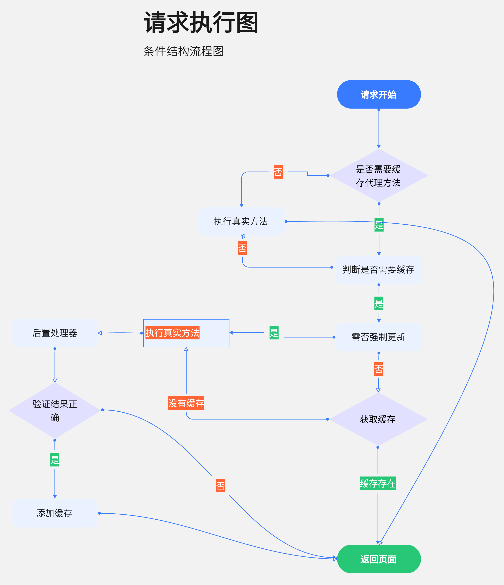

<!-- @format -->

# axios-cache-data


 

> `axios`官方文档在这 [axios](https://axios-http.com/)

> Tip：被缓存后所有的响应信息都是初次请求状态，服务器删除该数据或者修改该数据都不会有感知 ，可以设置缓存时间
> 增加请求分组

> Tip：代理 axios 对象 实现缓存
> Tip: 取消 axios adapter 的实现方式

<!-- TOC -->

- [axios-cache-data](#axios-cache-data)
    - [1. 创建缓存类](#1-创建缓存类)
    - [2. 或者创建缓存实例](#2-或者创建缓存实例)
    - [3. 强制更新或使用缓存](#3-强制更新或使用缓存)
        - [3.1. 序列化数据](#31-序列化数据)
    - [4. 参数说明](#4-参数说明)
        - [4.1. 创建适配器的公共参数](#41-创建适配器的公共参数)
        - [4.2. 每一个请求缓存参数](#42-每一个请求缓存参数)
    - [5. 执行流程图](#5-执行流程图)

<!-- /TOC -->

## 1. 创建缓存类

```typescript
/**
 * 自己提供网络适配器进行请求
 */
const config: AxiosRequestConfig = {
		baseURL: "xxx"
	};
//对自己网络请求定制
const instance: AxiosInstance = axios.create(config);
/**
 * 缓存客户端
 */
const cacheInstance: CacheAxios = CacheAxios.create({
	                                                    adapter: (con) => instance.request(con),
	                                                    maxAge: 1000 * 60 * 30,
	                                                    valid(response: AxiosResponse): boolean {
		                                                    return response.status === 200 && response.data.code === 200;
	                                                    }
	                                                    cacheInstance.clear();//清除所有的缓存
	                                                    cacheInstance.clear(config)//某个指定的缓存 注意和你请求的配置要一样
                                                    
                                                    });
```

## 2. 或者创建缓存实例

```typescript
import { http } from "lib/index";

const axiosInstance = http.proxy(/*你的axios对象*/,/*配置*/)/*返回一个被代理axios的实例*/
const axiosInstance = http(/*全局配置*/)/*返回一个被代理axios的实例*/
//...
```

## 3. 强制更新或使用缓存

```typescript
import { http } from "lib/index";

const axiosInstance = http.proxy(/*你的axios对象*/,/*配置*/)/*返回一个被代理axios的实例*/
const axiosInstance = http(/*全局配置*/)/*返回一个被代理axios的实例*/
axiosInstance.post(url, {}, { force: true }); //缓存会失效 并且删除缓存 重新走网络请求
axiosInstance.post(url, {}, { hit: true }); //在没有全局开启缓存这个会开启缓存
axiosInstance.clear()//
// 或使用
const instance = axios.withCache(options); //使用代理对象时会代理clear属性
instance.clear();
```

### 3.1. 序列化数据

```typescript
import axios    from "axios";
import { http } from "lib/index";

http({
	     message: {
		     /*配置自己的序列化反序列化 注: 两个都要同时实现，保持 序列化和反序列化的一致性*/
	     }
     });
```

## 4. 参数说明

```typescript
export interface CacheInstance extends AxiosRequestConfig {
	/**
	 * @default 1000*60*60
	 */
	readonly maxAge?: number;
	readonly key?: string;
	//存储缓存 {window.sessionStorage| localStorage | 自实现的Storage}
	
	readonly storage?: Storage;
	
	readonly proxy?: Method[];
	
	readonly enableCache?: boolean;
	
	/**
	 * 公共的key前缀 生成key需要获取到 因为可以根据prefix删除和网络请求有关的请求
	 */
	readonly prefix?: string;
	
	/**
	 * 消息转换
	 * 可以在里面配置 敏感信息加密
	 */
	readonly message?: {
		serialization: Serialization; deserialization: Deserialization;
	};
	
	/**
	 * 验证返回值是否合法 排除错误信息 被保存到了缓存里，导致脏数据
	 * @param {AxiosResponse} response
	 * @return {boolean}
	 */
	valid?(response: AxiosResponse): boolean;
	
	// 生成一次请求唯一次的key 需要保持一个请求在一个请求参数下保持唯一
	generateKey?(key: string | undefined, url: string | undefined, method: any, header: any, params: string,
	             data: string): string;
}

axiosInstance.get(url, {
	group: number | string,
	hit: true,//开启缓存
	force: true, //强制更新 优先级高于hit
	expire: number, //设置缓存时间 优先级高于 base maxAge
	valid(res): boolean
	...
})
```

---

### 4.1. 创建适配器的公共参数

|     参数      |                    介绍                    | 默认值                       |
|:-----------:|:----------------------------------------:|---------------------------|
|   maxAge    |                  缓存最大时间                  | **1000 _ 60 _ 60** （单位毫秒） |
|     key     |                生成 key 标识                 | **HTTP_CACHE_CACHE**      |
|   storage   |                   缓存组件                   | **window.sessionStorage** |
|   prefix    |               网络缓 key 存前缀                | **AXIOS-CACHE**           |
| enableCache |                  开启全局缓存                  | **false**                 |
| generateKey |              生成一个请求唯一标识 key              |                           |
|   message   |                消息序列化和反序列化                |                           |
|    valid    |            验证消息是否正确防止消息错误却被缓存            |                           |
|    proxy    | 指定缓存方法`request` `get` `post` `delete`... | ["get","post"]            |

### 4.2. 每一个请求缓存参数

|  hit   |   是否需要命中缓存(优先级高于全局配置)   |
|:------:|:-----------------------:|
| force  | 强制走网络请求,并刷新缓存（如果开启了缓存的） |
| expire |          过期时间           |
| valid  |   验证消息是否正确防止消息错误却被缓存    |
| group  |    对请求分组，在清除缓存可以定向清除    |

> hit false 全局开启缓存也不会命中缓存

## 5. 执行流程图

